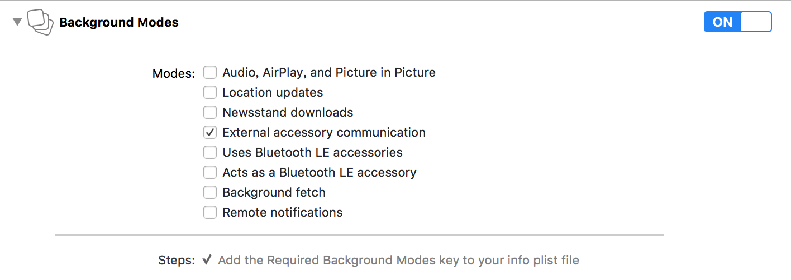

# SmartDeviceLink iOS集成指南
本文将介绍如何在iOS应用程序上集成SmartDeviceLink iOS Proxy 5.0.0或以上版本，同时提供一些实例供开发人员参考。
## 安装SmartDeviceLink
### Cocoapods
我们建议使用Cocoapods来安装最新的SmartDeviceLink iOS proxy。如果你的Mac上没有安装Cocoapods，你可以打开终端，输入下面的命令来安装Cocoapods
```bash
$sudo gem install cocoapods
```
如果在安装时碰到问题，你可以访问[Cocoapods官方指南](https://guides.cocoapods.org/using/getting-started.html#getting-started)来获得更多的信息。

Cocoapods安装完成后，在应用程序工程里创建一个空的Podfile，在终端里输入
```shell
$pod init
```
在Podfile里添加如下内容
```shell
target ‘Your_Project_Name’ do
    pod ‘SmartDeviceLink-iOS’, ‘~> SDL_Version’
end
```
将"Your_Project_Name"替换成你的APP工程名字，将"SDL_Version"换成你想要集成的SmartDeviceLink iOS proxy版本。你可以访问[SmartDeviceLink GitHub](https://github.com/smartdevicelink/sdl_ios/releases)来查看当前SmartDeviceLink iOS Proxy最新的release版本。一般情况下，我们建议开发人员采用最新版本的正式release。如果release的标签上带有**Candidate**字样，这说明该release可能不是最终版本，建议开发人员不要使用。

创建好pod文件后，在终端上进入pod文件所在目录，输入
```shell
$pod install
```
来安装SmartDeviceLink代码。
### XCODE
SmartDeviceLink安装完成以后，使用XCODE打开workspace。
#### Capabilities
在工程的Capabilities里，打开Background Modes，勾选External accessories communication。

#### Protocol Strings
如果应用程序需要通过USB或者Bluetooth和车机建立连接，应用程序需要支持一系列Protocol String。打开应用程序的info.plist文件，加入
```XML
<key>UISupportedExternalAccessoryProtocols</key>
    <array>
        <string>com.smartdevicelink.prot29</string>
        <string>com.smartdevicelink.prot28</string>
        <string>com.smartdevicelink.prot27</string>
        <string>com.smartdevicelink.prot26</string>
        <string>com.smartdevicelink.prot25</string>
        <string>com.smartdevicelink.prot24</string>
        <string>com.smartdevicelink.prot23</string>
        <string>com.smartdevicelink.prot22</string>
        <string>com.smartdevicelink.prot21</string>
        <string>com.smartdevicelink.prot20</string>
        <string>com.smartdevicelink.prot19</string>
        <string>com.smartdevicelink.prot18</string>
        <string>com.smartdevicelink.prot17</string>
        <string>com.smartdevicelink.prot16</string>
        <string>com.smartdevicelink.prot15</string>
        <string>com.smartdevicelink.prot14</string>
        <string>com.smartdevicelink.prot13</string>
        <string>com.smartdevicelink.prot12</string>
        <string>com.smartdevicelink.prot11</string>
        <string>com.smartdevicelink.prot10</string>
        <string>com.smartdevicelink.prot9</string>
        <string>com.smartdevicelink.prot8</string>
        <string>com.smartdevicelink.prot7</string>
        <string>com.smartdevicelink.prot6</string>
        <string>com.smartdevicelink.prot5</string>
        <string>com.smartdevicelink.prot4</string>
        <string>com.smartdevicelink.prot3</string>
        <string>com.smartdevicelink.prot2</string>
        <string>com.smartdevicelink.prot1</string>
        <string>com.smartdevicelink.prot0</string>
        <string>com.ford.sync.prot0</string>
        <string>com.smartdevicelink.multisession</string>
    </array>
```
如果应用程序采用Wi-Fi连接方式，那么以上Protocol String内容则不是必须的。
**请注意**，如果应用程序有集成过4.7.0之前的SmartDeviceLink iOS proxy，需要将Protocol String里的“com.smartdevicelink.prot29”替换成“com.smartdevicelink.multisession”，不然可能会出现连接问题。
### App Id
每个应用程序都需要被分配一个App Id，这个App Id不同于Apple bundle id，它被用来管理应用程序有哪些访问车辆数据的权限。要取得App Id，请访问[SmartDeviceLink网站](https://www.smartdevicelink.com)。
## 使用SmartDeviceLink (Objective-C)
### 创建Manager
首先需要创建一个SmartDeviceLink Proxy管理类，用于关于SDL连接和RPC管理。
#### MySDLManager.h
```objc
#import <Foundation/Foundation.h>

@interface MySDLManager : NSObject

+ (instancetype)shareManager;
- (void)connect;

@end
```
#### MySDLManager.m
首先需要添加SmartDeviceLink iOS的库文件
```objc
#import "SmartDeviceLink.h"
```
然后是正文
```objc
@interface MySDLManager()<SDLManagerDelegate>

@property (strong, nonatomic) SDLManager* sdlManager;

@end

@implementation MySDLManager

+ (instancetype)shareManager {
    static MySDLManager* sharedManager = nil;
    static dispatch_once_t onceToken;
    dispatch_once(&onceToken, ^{
        sharedManager = [[MySDLManager alloc] init];
    });
    return sharedManager;
}

- (instancetype)init {
    self = [super init];
    if (!self) {
        return nil;
    }
    // Add SDL proxy configuration here...
    return self;
}

- (void)connect {
    [self.sdlManager startWithReadyHandler:^(BOOL success, NSError * _Nullable error) {
        if (success) {
            // Your app has successfully connected with the SDL Core
        }
        else {
            NSLog(@"sdlManager connects failed, %@", error.debugDescription);
        }
    }];
}
```
如果希望应用程序在启动以后可以被动监听连接，一个简单的做法是在AppDelegate的didFinishLaunchingWithOptions里调用connect方法，你也可以在其他适当的时机调用connect方法来启用Proxy连接。
```objc
@implementation AppDelegate

- (BOOL)application:(UIApplication*)application didFinishLaunchingWithOptions:(NSDictionary*)launchOptions {
    // Override point for customization after application launch.
    [[MySDLManager shareManager] connect];
    return YES;
}

@end
```
记得在AppDelegate里添加MySDLManager的头文件
```objc
#import "MySDLManager.h"
```
### 初始化
你需要将初始化代码添加到MySDLManager的init方法里，注释为“Add SDL proxy configuration here”的地方。
#### App Id和App Name
每个应用程序都有唯一的App Id，以及多个App Name，应用程序可以使用多个App Name中的任意一个。
```objc
SDLLifecycleConfiguration* lifecycleConfig = [SDLLifecycleConfiguration defaultConfigurationWithAppName:appName appId:appId];
```
#### 应用程序图标
目前应用程序图标只支持PNG和JPG两种格式，上传成功后，应用程序图标会和App Name一起显示在车机上。我们建议控制图标文件的大小，不要传输太大的图标，不然可能会导致图标无法及时显示。
```objc
UIImage* appImage = [UIImage imageNamed:appIcon];
SDLArtworkImageFormat imageFormat = isIconFormatPng ? SDLArtworkImageFormatPNG : SDLArtworkImageFormatJPG;
if (appImage) {
    SDLArtwork* icon = [SDLArtwork persistentArtworkWithImage:appImage name:appIcon asImageFormat:imageFormat];
    lifecycleConfig.appIcon = icon;
}
```
#### 应用程序类型
对于非导航类应用程序，应用程序类型只有Media和Default两种。如果你的应用程序不是需要播放音频的音乐或多媒体APP，建议将应用程序类型设置为Default。
```objc
lifecycleConfig.appType = (isMediaApp ? SDLAppHMITypeMedia : SDLAppHMITypeDefault);
```
#### 其他
```objc
SDLConfiguration* config = [SDLConfiguration configurationWithLifecycle:lifecycleConfig
  lockScreen:SDLLockScreenConfiguration.disabledConfiguration
  logging:SDLLogConfiguration.defaultConfiguration];
self.sdlManager = [[SDLManager alloc] initWithConfiguration:config delegate:self];
```
### SDLManager代理
SmartDeviceLink Manager还需要实现下面两个方法。

一个是proxy断开连接时候的处理，比如一些标志位的重置。
```objc
- (void)managerDidDisconnect {
    // handle when SDL is disconnected
}
```
一个是HMILevel变化的处理。
```objc
- (void)hmiLevel:(SDLHMILevel)oldLevel didChangeToLevel:(SDLHMILevel)newLevel {
    if (([oldLevel isEqualToEnum:SDLHMILevelNone] || [oldLevel isEqualToEnum:SDLHMILevelBackground])
        && [newLevel isEqualToEnum:SDLHMILevelFull]) {
        // From HMI NONE/BACKGROUND to FULL
    }
    else if (([oldLevel isEqualToEnum:SDLHMILevelFull] || [oldLevel isEqualToEnum:SDLHMILevelLimited])
             && [newLevel isEqualToEnum:SDLHMILevelNone]) {
        // From HMI FULL/LIMITED to NONE
    }
}
```
## 结束
至此为止，SmartDeviceLink应该已经集成到你的应用程序里，关于SmartDeviceLink的详细使用方法，请参见各个示例。
