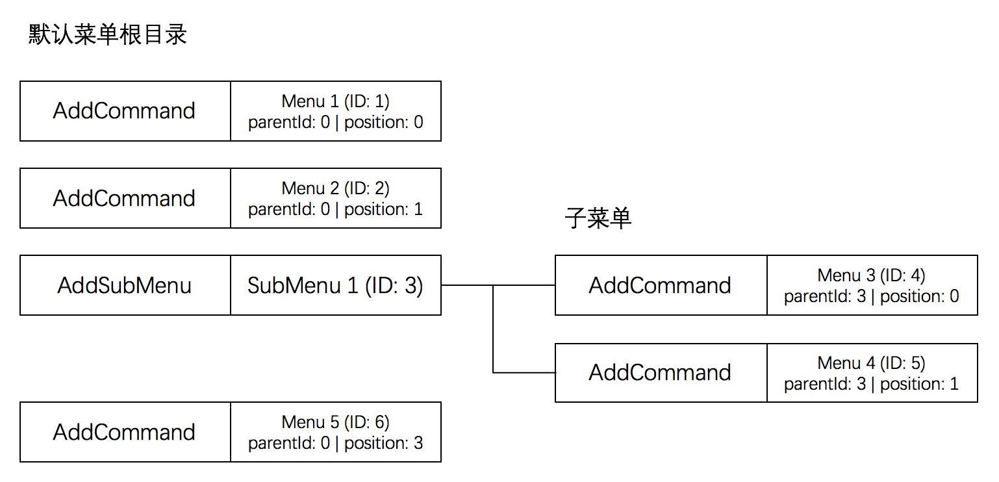

# SmartDeviceLink Sample
## HelloSDL_default
简单的SmartDeviceLink iOS示例，该例子仅包含最基本的SmartDeviceLink代码，包括SmartDeviceLink iOS proxy初始化和proxy连接。
## HelloSDL_menu
该示例演示了如何设置菜单。应用程序有两种方式添加菜单，一种是直接在默认菜单里添加项目，还有一种是自定义弹出菜单。
### 默认菜单
每个应用程序都有一个默认菜单按钮，应用程序起始的默认菜单是空的，里面只有一个“退出应用程序”。SDLAddCommand可以用来添加菜单按钮。一个菜单按钮可以被放置在默认菜单的根目录下，这样该按钮会出现在菜单第一层；菜单按钮也可以被放置在子菜单里，这样该按钮会出现在菜单第二层。

每个菜单按钮都有自己的ID，应用程序可以从1开始计数，ID随着新菜单按钮的添加递增。如果菜单按钮在根目录下，父菜单ID（parentId）设置为0。如果菜单属于某个子菜单，那么父菜单ID需要设置为子菜单（SubMenu）的ID。菜单的位置（position）表示菜单在目录里的位置，位置从0开始计数，子菜单里的菜单也是从0开始重新计数。

#### 添加菜单按钮
应用程序还可以设置菜单按钮对应的语音指令集，如果车机不支持语音指令或者应用程序不考虑语音支持，也可以不设置语音指令集。
```objc
NSArray<NSString*>* vrCommands = [NSArray arrayWithObjects:@"Menu 1", nil];

SDLAddCommand* addCommand = [[SDLAddCommand alloc] initWithId:commandId vrCommands:vrCommands  handler:^(SDLOnCommand * _Nonnull command) {
    if ([command.triggerSource isEqualToEnum:SDLTriggerSourceMenu]) {
        // The Menu Item Was Selected
    }
}];

SDLMenuParams* menuParam = [[SDLMenuParams alloc] initWithMenuName:@"Menu 1" parentId:parentId position:position];
addCommand.menuParams = menuParam;

[self.sdlManager sendRequest:addCommand withResponseHandler:^(__kindof SDLRPCRequest * _Nullable request, __kindof SDLRPCResponse * _Nullable response, NSError * _Nullable error) {
    if ([response.resultCode isEqualToEnum:SDLResultSuccess]) {
        // The Menu Item was created successfully
    }
}];
```
#### 添加子菜单
应用程序可以用SDLAddSubMenu来添加一个子菜单。子菜单位于默认菜单的根目录下，和普通菜单的区别在于子菜单包含二级菜单。子菜单只能添加在根目录下，子菜单不能包含子菜单。
```objc
SDLAddSubMenu* addSubMenu = [[SDLAddSubMenu alloc] initWithId:commandId menuName:@"SubMenu 1"];    
[self.sdlManager sendRequest:addSubMenu withResponseHandler:^(__kindof SDLRPCRequest * _Nullable request, __kindof SDLRPCResponse * _Nullable response, NSError * _Nullable error) {
    if ([response.resultCode isEqualToEnum:SDLResultSuccess]) {
        // The submenu was created successfully
        // Now You can add its menu item from here
    }
}];
```
#### 删除菜单
应用程序可以用SDLDeleteCommand删除之前添加的菜单，提供菜单的ID来指定要删除的菜单按钮。
```objc
SDLDeleteCommand* deleteCommand = [[SDLDeleteCommand alloc] initWithId:commandId];
[self.sdlManager sendRequest:deleteCommand withResponseHandler:^(__kindof SDLRPCRequest * _Nullable request, __kindof SDLRPCResponse * _Nullable response, NSError * _Nullable error) {
    if ([response.resultCode isEqualToEnum:SDLResultSuccess]) {
        // The Menu Item was deleted successfully
    }
}];
```
### 自定义菜单
应用程序可以使用SDLPerformInteraction来创建自定义菜单。在创建自定义菜单之前，应用程序需要先创建ChoiceSet，ChoiceSet是由SDLChoice组成的。每个SDLChoice都有一个ChoiceId，ChoiceId的作用和AddCommand的commandId作用一样，应用程序用它来识别具体的Choice。
```objc
NSArray<NSString*>* vrCommands = [NSArray arrayWithObjects:@"Choice 1", nil];
SDLChoice* choice = [[SDLChoice alloc] initWithId:choiceId menuName:@"Choice 1" vrCommands:vrCommands];
```
创建好ChoiceSet以后，应用程序可以用SDLCreateInteractionChoiceSet创建ChoiceSet。
```objc
SDLCreateInteractionChoiceSet* createInteractionChoiceSet = [[SDLCreateInteractionChoiceSet alloc] initWithId:choiceSetId choiceSet:choiceSet];
[self.sdlManager sendRequest:createInteractionChoiceSet withResponseHandler:^(__kindof SDLRPCRequest * _Nullable request, __kindof SDLRPCResponse * _Nullable response, NSError * _Nullable error) {
    // The create choice set request was successful
}];
```
创建好了以后，应用程序可以用SDLPerformInteraction来打开自定义菜单。应用程序需要在自定义菜单里指定ChoiceSetId，也就是之前创建的，然后设置PerformInteraction的参数。PerformInteraction有两种布局，一种是列表（list），一种是方块（tile）。
```objc
SDLPerformInteraction* performInteraction = [[SDLPerformInteraction alloc] initWithInitialPrompt:@"Hello S D L" initialText:@"HelloSDL" interactionChoiceSetID:choiceSetId];

performInteraction.interactionLayout = SDLLayoutModeListOnly;
performInteraction.interactionMode = SDLInteractionModeManualOnly;
performInteraction.timeout = @10000;

[self.sdlManager sendRequest:performInteraction withResponseHandler:^(__kindof SDLRPCRequest * _Nullable request, __kindof SDLRPCResponse * _Nullable response, NSError * _Nullable error) {
    if ([response.resultCode isEqualToEnum:SDLResultSuccess]) {
        SDLPerformInteractionResponse* res = (SDLPerformInteractionResponse*)response;
        if ([res.resultCode isEqualToEnum:SDLResultSuccess]) {
            // The choice (res.choiceId) Was Selected
        }
    }
}];
```
## HelloSDL_media
该示例演示了多媒体应用程序相关的代码，包括显示歌曲相关信息（metadata），显示专辑图片，显示播放时间和歌曲进度条。
### 设置HMI模版
应用程序可以用SDLSetDisplayLayout来设置HMI模版。应用程序可以在收到HMI FULL后设置HMI模版。通常情况下，多媒体类应用程序的HMI模版设为“MEDIA”即可。
```objc
SDLSetDisplayLayout* setDisplayLayout = [[SDLSetDisplayLayout alloc] initWithLayout:@"MEDIA"];
[self.sdlManager sendRequest:setDisplayLayout withResponseHandler:^(__kindof SDLRPCRequest * _Nullable request, __kindof SDLRPCResponse * _Nullable response, NSError * _Nullable error) {
    if ([response.resultCode isEqualToEnum:SDLResultSuccess]) {
        // Set display layout successful
    }
}];
```
SmartDeviceLink为非媒体类的应用程序定义了其他HMI模版，你可以访问[SmartDeviceLink.com](https://www.smartdevicelink.com/zh-hans/guides/iOS/displaying-information/designing-the-user-interface/)获取更多关于HMI模版的信息。
### 显示歌曲信息
应用程序在设置HMI模版成功后，需要设置模版上的相应信息。应用程序可以显示歌曲名称和专辑信息（或者艺术家名称），设置后歌曲信息和专辑信息会同步显示在福特和林肯中高配置的车辆仪表盘上。应用程序可以同时设置歌曲曲目信息，建议采用A/B的格式，A表示当前曲目是第几首，B表示总曲目数量。
```objc
SDLShow* show = [[SDLShow alloc] initWithMainField1:@"Track title" mainField2:@"Artist or Album" alignment:SDLTextAlignmentLeft];
[show setMediaTrack:@"1/5"];
```
### 添加按钮
应用程序可以在模版上添加自定义按钮。自定义按钮有三种类型，如果只需要在按钮上显示文本，按钮类型可以设置为SDLSoftButtonTypeText；如果只需要在按钮上显示图标，按钮类型可以设置为SDLSoftButtonTypeImage；如果同时需要在按钮上显示文本和图标，按钮类型可以设置为SDLSoftButtonTypeBoth。如果需要按钮默认处于高亮状态，可以将highlighted设置为YES。如果需要添加多个按钮，请确保不同的按钮使用不同的ID（buttonId）。
```objc
SDLSoftButton* softButton1 = [[SDLSoftButton alloc] initWithType:SDLSoftButtonTypeText text:@"Button1" image:nil highlighted:NO buttonId:1 systemAction:SDLSystemActionDefaultAction handler:^(SDLOnButtonPress * _Nullable buttonPress, SDLOnButtonEvent * _Nullable buttonEvent) {
    if ([buttonPress.buttonPressMode isEqualToEnum:SDLButtonPressModeShort]) {
        // Soft button was selected as short press
    }
}];
NSArray<SDLSoftButton*>* softButton = [NSArray arrayWithObjects:softButton1, nil];
[show setSoftButtons:softButton];
```
### 显示专辑图片
应用程序还可以将专辑图片显示在模版上。应用程序需要先判断车机是否支持显示图片。在SmartDeviceLink连接成功后，应用程序可以通过SDLDisplayCapabilities来判断车机是否支持图片显示。
```objc
- (void)connect {
    __weak typeof (self) weakSelf = self;

    [self.sdlManager startWithReadyHandler:^(BOOL success, NSError * _Nullable error) {
        if (success) {
            // Your app has successfully connected with the SDL Core            
            SDLDisplayCapabilities *displayCapabilities = weakSelf.sdlManager.registerResponse.displayCapabilities;
            if (displayCapabilities) {
                _areGraphicsSupported = displayCapabilities.graphicSupported.boolValue;
            }
        }
    }];
}
```
通常情况下，应用程序切换歌曲后车机HMI上显示的歌曲信息需要立刻刷新。由于专辑图片需要花费一些时间完成上传，为了避免产生歌曲信息和专辑图片不匹配的情况出现，应用程序可以事先上传一个默认的专辑图片，在新的专辑图片没有就绪之前，先显示默认的专辑图片来替代上一首歌曲的专辑图片。
```
// Set default album image first
SDLImage* image = [[SDLImage alloc] initWithName:@"default_album.png" ofType:SDLImageTypeDynamic];
[show setGraphic:image];
```
之后应用程序上传新的专辑图片，上传成功后再设置专辑图片。如果应用程序之前上传过专辑图片，第二次需要显示该图片的之前不用再次上传。
```objc
UIImage* albumImage = [UIImage imageNamed:@"album.png"];
SDLArtwork* album = [SDLArtwork persistentArtworkWithImage:albumImage name:@"album.png" asImageFormat:SDLArtworkImageFormatPNG];
[self.sdlManager.fileManager uploadFile:album completionHandler:^(BOOL success,NSUInteger bytesAvailable, NSError * _Nullable error) {
    if ([response.resultCode isEqualToEnum:SDLResultSuccess]) {
        // Image file upload was successful
    }
}];
```
图片上传成功后，应用程序可以再次通过SDLShow将图片显示到模版上。
```objc
SDLShow* show = [[SDLShow alloc] initWithMainField1:@"Track name" mainField2:@"artist" alignment:SDLTextAlignmentLeft];
SDLImage* image = [[SDLImage alloc] initWithName:@"album.png" ofType:SDLImageTypeDynamic];
[show setGraphic:image];
[self.sdlManager sendRequest:show withResponseHandler:^(__kindof SDLRPCRequest * _Nullable request, __kindof SDLRPCResponse * _Nullable response, NSError * _Nullable error) {
    if ([response.resultCode isEqualToEnum:SDLResultSuccess]) {
        // Show was created successful      
    }
}];
```
### 显示播放进度条
应用程序可以通过SDLSetMediaClockTimer设置歌曲播放进度条。应用程序可以设置进度条的起始时间（startTime）和结束时间（endTime），设置完成以后车机会自动计时，除非用户采用了快进，暂停或者切换曲目等操作，否则应用程序不用时时更新进度条状态。
```objc
SDLSetMediaClockTimer* setMediaClockTimer = [[SDLSetMediaClockTimer alloc] initWithUpdateMode:SDLUpdateModeCountUp hours:0 minutes:0 seconds:0];
SDLStartTime* endTime = [[SDLStartTime alloc] initWithHours:0 minutes:minutes seconds:seconds];
[setMediaClockTimer setEndTime:endTime];
[self.sdlManager sendRequest:setMediaClockTimer withResponseHandler:^(__kindof SDLRPCRequest * _Nullable request, __kindof SDLRPCResponse * _Nullable response, NSError * _Nullable error) {
  if ([response.resultCode isEqualToEnum:SDLResultSuccess]) {
      // Set media clock timer successful
  }
}];
```
### 用户操作反馈
应用程序需要订阅媒体HMI模版上的按钮来获得用户操作反馈，一般情况下应用程序选择性订阅订阅如下按钮。
```
* SDLButtonNameOk - Play/Pause
* SDLButtonNameSeekLeft - Previous track
* SDLButtonNameSeekRight - Next track
```
下面代码演示如何订阅OK按钮（Play/Pause），其他按钮的订阅方式和OK按钮一样。
```objc
SDLSubscribeButton* subscribeButtonOK = [[SDLSubscribeButton alloc] initWithButtonName:SDLButtonNameOk handler:^(SDLOnButtonPress * _Nullable buttonPress, SDLOnButtonEvent * _Nullable buttonEvent) {
    if ([buttonPress.buttonPressMode isEqualToEnum:SDLButtonPressModeShort]) {
        // Play/Pause button was selected
    }
}];
[self.sdlManager sendRequest:subscribeButtonOK];
```
你可以访问[SmartDeviceLink.com](https://www.smartdevicelink.com/zh-hans/guides/iOS/displaying-information/text-images-and-buttons/)里的“SUBSCRIBE BUTTONS”部分查看更多可订阅按钮。
## HelloSDL_other
该示例演示了一些SmartDeviceLink其他功能。
### 弹出框
应用程序可以通过SDLAlert来弹出提示（Alert）。弹出框最多可以显示三行文本，应用程序可以选择显示一行，两行或者三行文本。弹出框显示的持续时间（duration）范围是3秒到10秒。应用程序可以选择在弹出框上显示按钮（softButton），添加按钮的方式和在HMI模版上添加按钮的方式一样。除非按钮的类型被设置为SDLSoftButtonTypeText，否则按钮在按下后弹出框会自动关闭。
```objc
SDLAlert* alert = [[SDLAlert alloc] initWithAlertText1:@"text 1" alertText2:@"text 2" duration:5000];

// Soft button
SDLSoftButton* buttonOk = [[SDLSoftButton alloc] initWithType:SDLSoftButtonTypeText text:@"OK" image:nil highlighted:NO buttonId:1 systemAction:SDLSystemActionDefaultAction handler:^(SDLOnButtonPress * _Nullable buttonPress, SDLOnButtonEvent * _Nullable buttonEvent) {
    if ([buttonPress.buttonPressMode isEqualToEnum:SDLButtonPressModeShort]) {
        // Button OK was selected
    }
}];
NSArray<SDLSoftButton*>* softButtons = [NSArray arrayWithObjects:buttonOk, nil];
[alert setSoftButtons:softButtons];

// Add other alert setting here

[self.sdlManager sendRequest:alert withResponseHandler:^(__kindof SDLRPCRequest * _Nullable request, __kindof SDLRPCResponse * _Nullable response, NSError * _Nullable error) {
    if ([response.resultCode isEqualToEnum:SDLResultSuccess]) {
        // Alert was dismissed successful
    }
}];
```
应用程序也可以给弹出框设置提示音和进度条提示。进度条可以告诉用户该提示框显示时间还有多久，但是能否显示取决于车机是否支持。
```objc
alert.playTone = @YES;
alert.progressIndicator = @YES;
```
### 键盘
应用程序可以通过SDLPerformInteraction显示车机的键盘来提供输入功能，键盘的语言和支持的输入法取决于车机。比如车机的语言是中文，应用程序可以将键盘的语言设置为中文或者英文，应用程序首先需要通过SDLSetGlobalProperties将键盘语言设置为中文。
```objc
SDLSetGlobalProperties* setGlobalProperties = [[SDLSetGlobalProperties alloc] init];
SDLKeyboardProperties* keyboardProperties = [[SDLKeyboardProperties alloc] initWithLanguage:SDLLanguageZhCn layout:SDLKeyboardLayoutQWERTY keypressMode:SDLKeypressModeSingleKeypress limitedCharacterList:nil autoCompleteText:nil];
[setGlobalProperties setKeyboardProperties:keyboardProperties];  
[self.sdlManager sendRequest:setGlobalProperties withResponseHandler:^(__kindof SDLRPCRequest * _Nullable request, __kindof SDLRPCResponse * _Nullable response, NSError * _Nullable error) {
    if ([response.resultCode isEqualToEnum:SDLResultSuccess]) {
        // Set keyboard language successful
    }
}];
```
应用程序还可以在SDLSetGlobalProperties里设置键盘的按键通知模式，默认设置为SDLKeypressModeSingleKeypress。应用程序需要先注册SDLDidReceiveKeyboardInputNotificatio通知。
```objc
[[NSNotificationCenter defaultCenter] addObserver:self selector:@selector(didReceiveKeyboardInputNotification:) name:SDLDidReceiveKeyboardInputNotification object:nil];
```
然后在回调函数里处理通知。用户按下键盘上面的语音按钮会关闭键盘，应用程序会先收到通知，接着收到键盘关闭的消息。用户按下键盘上的其他输入按钮不会关闭键盘，应用程序会收到按键通知。
```objc
- (void)didReceiveKeyboardInputNotification:(SDLRPCNotificationNotification*)notification {
    SDLOnKeyboardInput* onKeyboardInput = notification.notification;
    if ([onKeyboardInput.event isEqualToEnum:SDLKeyboardEventVoice]) {
        // User press voice button on keyboard
    }
    else if ([onKeyboardInput.event isEqualToEnum:SDLKeyboardEventKeypress]) {
        NSString* input = onKeyboardInput.data;
        // Receive keyboard input event
    }
}
```
应用程序通过SDLPerformInteraction显示键盘。键盘关闭后应用程序会收到SDLPerformInteractionResponse，如果用户完成输入后关闭键盘，ResultCode会是Success，否则ResultCode是Abort。
```objc
SDLPerformInteraction* performInteraction = [[SDLPerformInteraction alloc] initWithInitialPrompt:@"prompt" initialText:@"Hello" interactionChoiceSetIDList:@[] helpPrompt:@"help" timeoutPrompt:@"hurry up" interactionMode:SDLInteractionModeManualOnly timeout:10000];
[performInteraction setInteractionLayout:SDLLayoutModeKeyboard];  
[self.sdlManager sendRequest:performInteraction withResponseHandler:^(__kindof SDLRPCRequest * _Nullable request, __kindof SDLRPCResponse * _Nullable response, NSError * _Nullable error) {
    if ([response.resultCode isEqualToEnum:SDLResultSuccess]) {
        SDLPerformInteractionResponse* res = (SDLPerformInteractionResponse*)response;
        // Get keyboard input: res.manualTextEntry
    }
}];
```
### 音频输入
应用程序可以通过SDLPerformAudioPassThru来启用车载麦克风采集语音，启用后车机会显示一个对话框，并在播报完语音（prompt）后开始录音。录音时车机会实时将采集到的语音发送给应用程序，应用程序可以在录音过程中决定处理动作，或者对话框关闭后处理。
```objc
SDLPerformAudioPassThru* performAudioPassThru = [[SDLPerformAudioPassThru alloc] initWithInitialPrompt:@"Speak" audioPassThruDisplayText1:@"Text 1" audioPassThruDisplayText2:@"Text 2" samplingRate:SDLSamplingRate16KHZ bitsPerSample:SDLBitsPerSample16Bit audioType:SDLAudioTypePCM maxDuration:10000 muteAudio:YES];
[performAudioPassThru setAudioDataHandler:^(NSData * _Nullable audioData) {
    // Contiune collecting audio data
}];  
[self.sdlManager sendRequest:performAudioPassThru withResponseHandler:^(__kindof SDLRPCRequest * _Nullable request, __kindof SDLRPCResponse * _Nullable response, NSError * _Nullable error) {
    if ([response.resultCode isEqualToEnum:SDLResultSuccess]) {
        // APT was created successful
    }
}];
```
当录音对话框显示超时或者用户主动按下了对话框上的“完成”按钮，录音对话框会主动关闭，应用程序会收到成功（Success）的消息。如果用户主动按下了对话框上的“取消”按钮，应用程序会收到取消（Abort）的消息。如果应用程序希望主动中止录音，可以通过SDLEndAudioPassThru来关闭对话框。
```objc
SDLEndAudioPassThru* endAudioPassThru = [[SDLEndAudioPassThru alloc] init];
[self.sdlManager sendRequest:endAudioPassThru];
```
